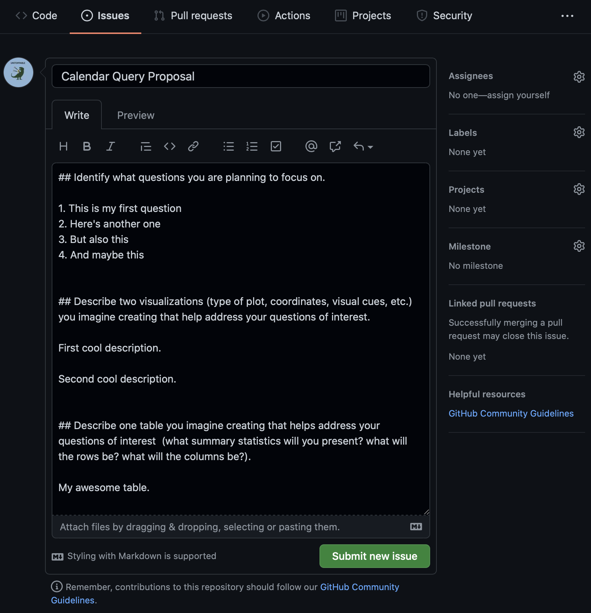

# Calendar Query Proposal 

Identify **2–4 primary questions** of interest to you about how you spend your time. I hope your questions address something meaningful to you, but **be sure you identify questions you feel comfortable sharing with me** (your reports will not be shared with the class) and that they are feasible for the 14-day data collection period. 

Feel free to expand upon the basic question of "How do I spend my time?" or explore a variation of it. Some other ideas include...

* Document *intended time* doing things (e.g. studying, sleeping) versus *actual time* doing those things, and compare results

* Document time spent on each course, and/or time spent on different parts of a course (e.g. in class, reading, homework, etc.)

* Document time spent on school vs. work vs. leisure vs. rest, etc.

* If you already use Google Calendar as a way to keep track of your schedule, you could compare how your time was spent last year at this time versus how your time is being spent now.

---

Respond to the following questions in the space below, then copy and paste the questions and your responses into a new issue in your private repo by **10pm ET on Thursday, September 9**. I will respond with my approval or comments for revision.

*Note that you are not wed to the ideas you record here.  The visualizations and table can change before your final submission.  But, I want to make sure your plan aligns with your questions and that you're on the right track.Note that you are not wed to the ideas you record here.  The visualizations and table can change before your final submission.  But, I want to make sure your plan aligns with your questions and that you're on the right track.*

## Identify what questions you are planning to focus on. 

## Describe two visualizations (type of plot, coordinates, visual cues, etc.) you imagine creating that help address your questions of interest.

## Describe one table you imagine creating that helps address your questions of interest  (what summary statistics will you present? what will the rows be? what will the columns be?).

